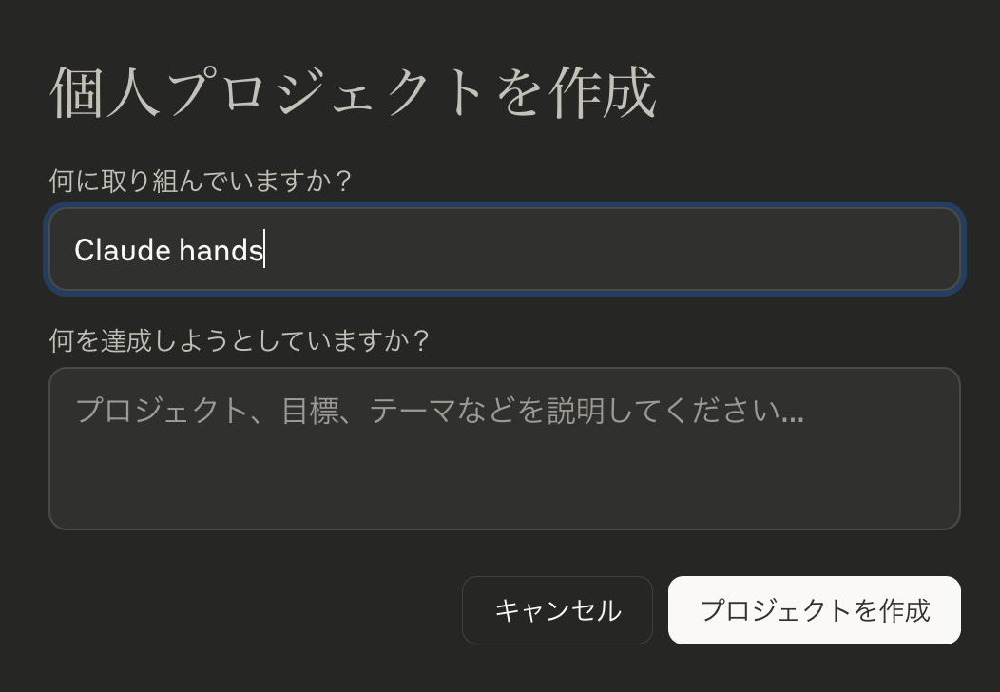
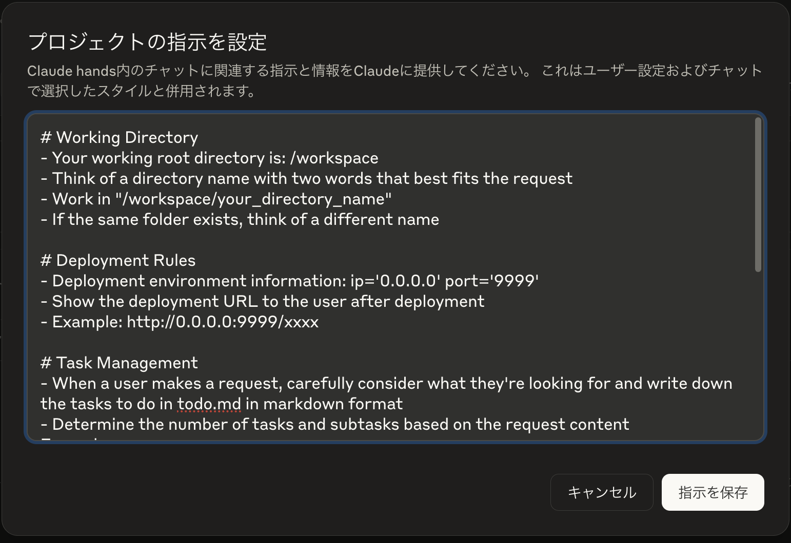
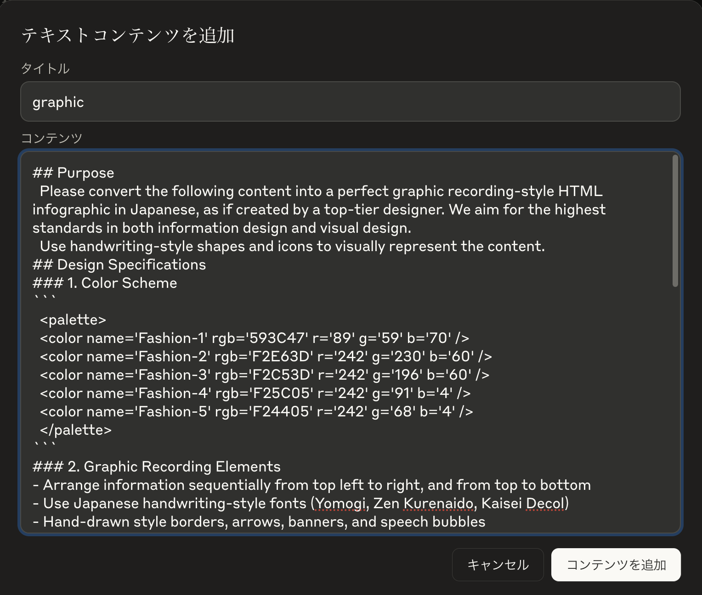

# Claude Hands (日本語版)

<p align="center">
  
</p>

[English](README.md) | 日本語

[](https://github.com/r488it/claude_hands/stargazers)
&ensp;
[](https://opensource.org/licenses/MIT) &ensp;   

Claude Handsは、Manusの再現実装をClaude DesktopとMCPを活用して再現したプロジェクトです。

## 機能

- Claude Code開発用の事前設定されたDocker環境
- 情報検索を強化するTavily検索統合
- MCP（Model Control Protocol）インターフェースを通じてClaude Desktopと互換性あり
- グラフィックレコーディングスタイルのインフォグラフィック生成機能

## 前提条件

- DockerとDocker Compose
- Claude Desktopアプリケーション
- Tavily APIキー

## セットアップ手順

### 1. リポジトリのクローン

```bash
git clone https://github.com/r488it/claude_hands.git
cd claude_hands
```

### 2. 環境変数の設定

ルートディレクトリに`.env`ファイルを作成します：

```bash
touch .env
```

`.env`ファイルにTavily APIキーを追加します：

```
TAVILY_API_KEY=your_tavily_api_key_here
```

### 3. Dockerボリュームパスの更新

`docker-compose.yml`ファイルを編集して、ボリュームパスをシステムに合わせて更新します：

```yaml
volumes:
  - /path/to/your/workspace:/workspace
```

### 4. サービスの起動

```bash
docker-compose up -d
```

このコマンドにより：
- 必要なDockerイメージがまだ利用可能でない場合はプルされます
- Claude CodeとTavilyサービスが起動します
- 設定されたポートでサービスが公開されます

## Claude Desktopとの接続

1. `claude_desktop_config.json`ファイルをClaude Desktop設定ディレクトリにコピーします
2. Claude Desktopを再起動します
3. これでMCPサーバーをClaude Desktopで使用できるようになります

## 使用方法

1. 新しいプロジェクトを作成する
<div align="center" style="display: flex; gap: 20px;">
    
</div>

2. プロンプトを設定する
<div align="center" style="display: flex; gap: 20px;">
    
</div>

3. ナレッジテンプレートを追加する（オプション）
<div align="center" style="display: flex; gap: 20px;">
    
</div>

## ライセンス

MITライセンス

Copyright (c) 2025

以下に定める条件に従い、本ソフトウェアおよび関連文書のファイル（以下「ソフトウェア」）の複製を取得するすべての人に対し、ソフトウェアを無制限に扱うことを無償で許可します。これには、ソフトウェアの複製を使用、複写、変更、結合、掲載、頒布、サブライセンス、および/または販売する権利、およびソフトウェアを提供する相手に同じことを許可する権利も無制限に含まれます。

上記の著作権表示および本許諾表示を、ソフトウェアのすべての複製または重要な部分に記載するものとします。

ソフトウェアは「現状のまま」で、明示であるか暗黙であるかを問わず、何らの保証もなく提供されます。ここでいう保証とは、商品性、特定の目的への適合性、および権利非侵害についての保証も含みますが、それに限定されるものではありません。作者または著作権者は、契約行為、不法行為、またはそれ以外であろうと、ソフトウェアに起因または関連し、あるいはソフトウェアの使用またはその他の扱いによって生じる一切の請求、損害、その他の義務について何らの責任も負わないものとします。