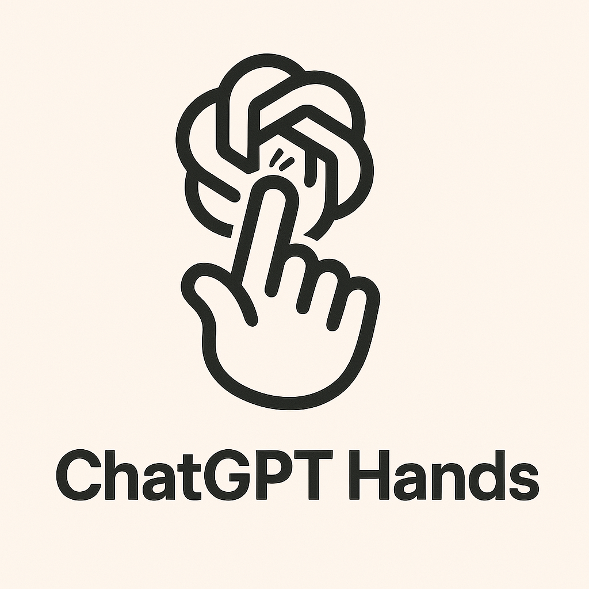

# Claude Hands

<p align="center">
  
  
</p>

English | [日本語](README.ja.md)

[](https://github.com/r488it/claude_hands/stargazers)
&ensp;
[](https://opensource.org/licenses/MIT) &ensp;


Claude Hands is a project that recreates Manus implementation using Claude Desktop and MCP (Model Control Protocol).


## update
2025.3.29 Browser operation supported.   
2025.3.29 ChatGPT Desktop supported. chatgpt_mcp_agent.config.yaml

## Recommended Model
- Claude 3.7 Sonnet
- Claude 3.7 Sonnet think mode

## Demo

https://github.com/user-attachments/assets/615c8973-c117-4012-9111-e44d594d6869

## Features

- Pre-configured Docker environment for Claude Code development
- Enhanced information retrieval with Tavily search integration
- Seamless compatibility with Claude Desktop through MCP interfaces
- Powerful graphic recording-style infographic generation capabilities

## Prerequisites

- Docker and Docker Compose
- Claude Desktop application
- Tavily API key

## Setup Instructions

### 1. Clone the Repository

```bash
git clone https://github.com/r488it/claude_hands.git
cd claude_hands
```

### 2. Configure Environment Variables

Create a `.env` file in the root directory:

```bash
touch .env
```

Add your Tavily API key and workspace path to the `.env` file:

```
TAVILY_API_KEY=your_tavily_api_key_here
WORKSPACE_PATH=/path/to/your/workspace
```

### 3. Start the Services

```bash
docker-compose up -d
```

This command will:
- Pull the required Docker images (if not already available)
- Start the Claude Code and Tavily services
- Make the services available on the configured ports

## Connecting with Claude Desktop

1. Copy the `claude_desktop_config.json` file to your Claude Desktop configuration directory
2. Restart Claude Desktop
3. You can now use the MCP servers through Claude Desktop

## Usage

1. Create a new project
<div align="center" style="display: flex; gap: 20px;">
    
</div>

2. Set up your prompt
<div align="center" style="display: flex; gap: 20px;">
    
</div>

3. Add knowledge template (optional)
<div align="center" style="display: flex; gap: 20px;">
    
</div>

## Star History

[](https://www.star-history.com/#r488it/claude_hands&Date)